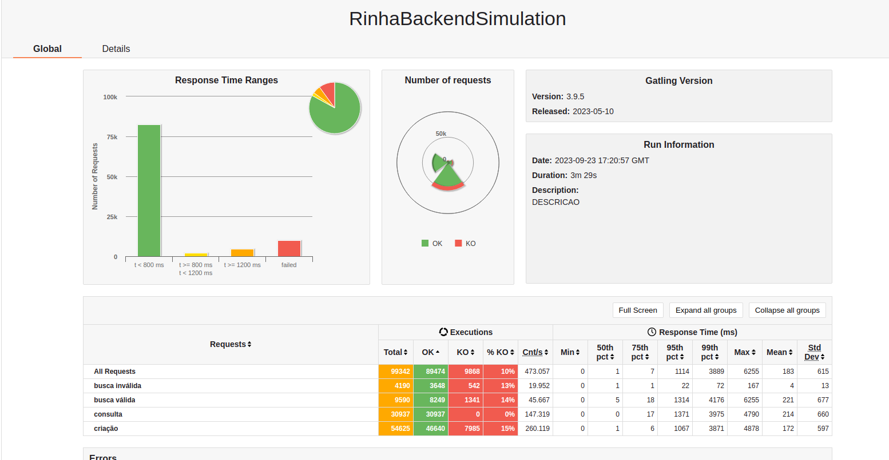

# Rinha Backend

This project was inspired by a community driven challenge that ran on August 2023:  

Challenge [Instructions](https://github.com/zanfranceschi/rinha-de-backend-2023-q3/tree/main)

Useful content from [Akita](https://www.youtube.com/watch?v=EifK2a_5K_U&t=3545s)

## Results V1
Is not good enough, so in the following days I'll be doing some improvements.

